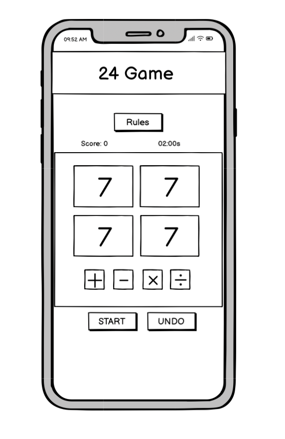
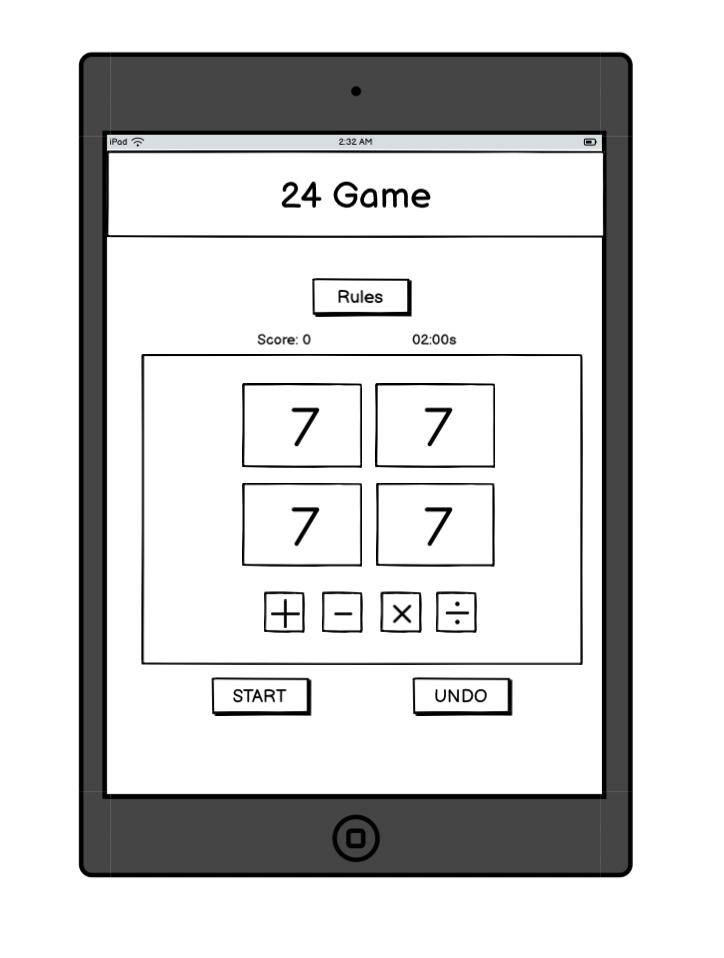

# Milestone_project_2

## Site Overview

[View Live Site.]() Hosted on GitHub Pages.

## Table Of Contents:

1. [Design & Planning](#design--planning)
   - [User Stories](#user-stories)
   - [Wireframes](#wireframes)
   - [Typography](#typography)
   - [Colour Scheme](#colour-scheme)
2. [Features](#features)
   - [Site Wide Features](#Site-wide-features)
3. [Technologies Used](#technologies-used)
4. [Testing](#testing)
5. [Bugs](#bugs)
6. [Deployment](#deployment)
7. [Credits](#credits)

## Design & Planning:

### User Stories

1. As a beginner, I want to be able to see the game rules to understand the game.
2. As a player, I want the game to prevent invalid moves (like dividing by zero or using negative/decimal results), so I play within the game’s rules.
3. As a player, I want to be able to deselect a number or operator, so that I can change my mind before committing to a move.
4. As a player, I want the interface to highlight which numbers and operators I’ve selected so I don’t get confused during my turn.
5. As a player, I want to see my score increase when I win so that I can track my progress.
6. As a player, I want to undo a move, so that I can try a different calculation if I make a mistake.
7. As an experienced player, I want the game to be timed to make the game more competitive and rewarding.
8. As a player, I want to be presented with my score at the end of the game so that I can attempt to beat it next time.
9. As a player, I want the option to quit the game and start again, so that I can reset my progress and begin a new game at any time.

### Wireframes

The wireframes for this website were created using Balsamiq to establish a clear and intuitive structure. I followed the mobile-first approach ensuring my site is optimised and responsive across all devices.

1. #### Mobile:

    <details><summary>Click to view wireframes</em></summary>

    

    </details>

2. #### Tablet:

    <details><summary>Click to view wireframes</em></summary>

    

    </details>

3. #### Desktop:

    <details><summary>Click to view wireframes</em></summary>

    

    </details>
    
### Typography

### Colour Scheme

## Features:

### Site Wide Features:

### Future enhancements

## Technologies Used

* HTML
    * The structure of the Website was developed using HTML as the main language.
* CSS
    * The Website was styled using custom CSS in an external file.
* Visual Studio Code
    * The website was developed using Visual Studio Code IDE.
* GitHub
    * Source code is hosted on GitHub and delpoyed using Git Pages.
* Git 
    * Used to commit and push code during the development phase of the Website.
* Font Awesome
    * Icons obtained from https://fontawesome.com/ were used as the Social media links in the footer section. 
* Favicon.io
    * favicon files were created at https://favicon.io/favicon-converter/ 
* balsamiq
    * wireframes were created using balsamiq from https://balsamiq.com/wireframes/desktop/#
*   Grammarly
    * Grammarly was used to spell check and catch mistakes in the website and README.md.

## Testing

## Bugs

## Deployment

### Version Control

The site was created using the Visual Studio code editor and pushed to github to the remote repository ‘S-and-S-care-mp1’.

The following git commands were used throughout development to push code to the remote repo:

```git add .``` - This command was used to add the file(s) to the staging area before they are committed.

```git commit -m “commit message”``` - This command was used to commit changes to the local repository queue ready for the final step.

```git push``` - This command was used to push all committed code to the remote repository on github.

### Deployment to Github Pages

- The site was deployed to GitHub pages. The steps to deploy are as follows: 
  - In the GitHub repository, navigate to the Settings tab 
  - From the menu on left select 'Pages'
  - From the source section drop-down menu, select the Branch: main
  - Click 'Save'
  - A live link will be displayed in a green banner when published successfully. 

The live link can be found here - https://alexthoma5.github.io/S-and-S-care-mp1/index.html

### Clone the Repository Code Locally

Navigate to the GitHub Repository you want to clone to use locally:

- Click on the code drop down button
- Click on HTTPS
- Copy the repository link to the clipboard
- Open your IDE of choice (git must be installed for the next steps)
- Type git clone copied-git-url into the IDE terminal

The project will now of been cloned on your local machine for use.

## Credits

### Acknowledgment
